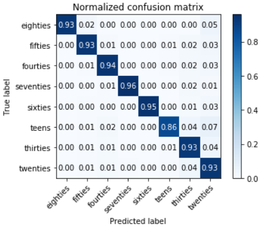

# Age Estimation based on Human Voice
Project developed for the "Intelligent Systems" master course.

This repository regards the use of machine learning to detect the age of people based on their voice.

The dataset used is [Common Voice](https://www.kaggle.com/datasets/mozillaorg/common-voice?select=README.txt) from which audio features are extrated to ease the learning task.

Project files:

- project_report.pdf: 
	the report about this project.

- converter.ipynb: 
	the jupyter notebook developed
	in order to convert the mp3 files in wav files.

- Age Estimation based on Human Voice.ipynb: 
	the jupyter notebook developed in order to analyze the dataset and train the machine learning model.

- best_model.html:
	the html version of the jupyter notebook in which was trained the
	machine learning model which led to the best recognition rates.

